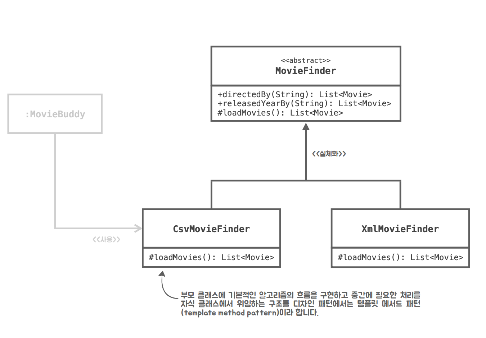
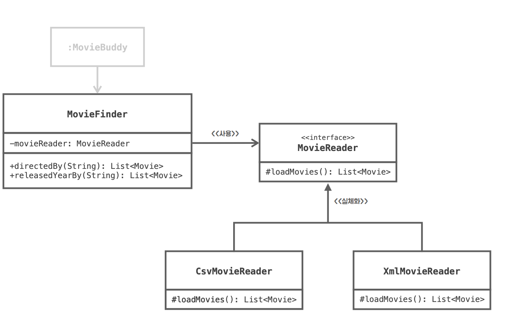

# Movie Search - GOD Object Anti-Pattern 리팩토링을 통한 Spring 학습
## 관심사의 분리(Seperate of Concerns, SoC)와 계층화
* 관심이 같은 것은 한 곳으로 모으고, 다른 것은 따로 떨어뜨려 서로 영향을 주지 않도록 분리한다.
## 계층 구조 (엔터프라이즈 애플리케이션 계층화)
* 프레젠테이션
  * HTML 기반 웹 ui나 모바일 앱으로 만들어지는 경우가 많다.
  * 데스크톱이나 명령줄 기반 클라이언트 역시 있음
  * 사용자에게 정보를 표시하고 명령을 도메인과 데이터 원본에서 처리할 수 있게 해주는 것.
* 도메인
  * 프로그램이 쓰이는 대상 분야라는 의미로 보통 많이 사용된다.
  * 비즈니스 논리라고도 부를 수 있다
  * 핵심 업무를 처리하는 객체들로 구성이 된다.
* 데이터 원본
## MovieSearch 프로젝트의 관심사
1. 사용자의 명령을 입력 받아 비즈니스 로직을 실행하고, 결과를 출력한다.
2. csv 파일로 작성된 영화 메타데이터를 읽어들인 후 조건에 맞는 영화를 검색한다.
3. 파일 또는 데이터베이스 시스템 등과 데이터 송/수신을 처리한다.
## 계층화와 관심사의 분리
* 계층화
  * domain 계층을 추가하여 Movie.class 를 옮겼다.
  * domain 계층에 MovieFinder.class를 추가하여 MovieSearchApplication에서 수행하던 작업을 분리했다.
* 관심사의 분리
  * MovieFinder.class 는 2가지 일을 한다.
    * csv를 읽고, 영화를 찾는다.
    * 따라서 Read와 Find로 구분할 수 있겠다.
## 개발 시 유의사항
* 쉽게 변경할 수 있는 코드를 짜야 한다 
* Read에서 csv와 xml을 읽는다고 한다 
  * 그런 의미에서 if문 분기로서 reader에서 csv와 xml를 구분해서는 안 된다! 
## is-a (상속) vs has-a (합성)
* 이 부분에 대한 추가 설명을 문서로 만드는 것이 좋겠다.
* 이 때 Read에서 csv와 xml을 읽는다고 했을 때
  * 상속으로 해결해본다면?
    
    * abstract class MovieFinder를 XmlMovieFinder와 CsvMovieFinder가 상속받아 구현하게 만들 수 있다.
      * 그러나 이는 캡슐화를 위반한다
      * 설계의 유연성을 해친다. (코드 재사용이 힘들 수 있다. abstract class는 모든 메서드가 추상 메서드이니까)
  * 합성으로 해결해본다면?
    
    * 합성은 다르객체의 인스턴스를 자신의 인스턴스 변수로 포함하는 방법. 이 때 참조하는 방법은 인터페이스로!
    * MovieFinder가 MovieReader를 사용하는데, 이 때 MovieReader만 인터페이스로 선언하여 다음을 둔다.
      * CsvMovieReader
      * XmlMovieReader
  * 상속 vs 합성
    * 만약 상속인 상태에서 json Read 기능이 또 추가된다면?
      * abstract class MovieFinder를 상속받아서 혹은 일반 상속이라 하더라도 '클래스의 폭발' 문제가 생긴다
      * 매번 기능이 추가될 때마다 새로운 Finder가 추가되는 것이다.
    * 합성인 상태에서 json Read가 추가된다면?
      * MovieReader 인터페이스의 새로운 구현체에서 loadMovies()만 override 해주면 끝!
## JAXB(Java Architecture for XML Binding)
### 자바 클래스를 XML로 표현하는 자바 표준 API
* Marshalling : 자바 객체 -> XML 문서
* Unmarshalling : XML 문서 -> 자바 객체
###Junit을 이용한 테스트 코드 작성
* gradle.build에 dependency 추가
* test{}에 JUnit5 플랫폼을 사용할 것을 명시